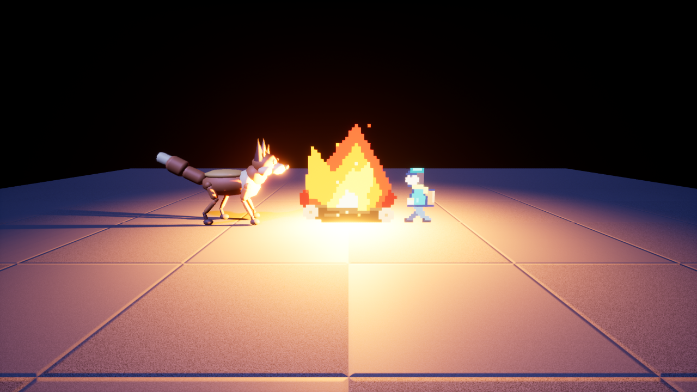
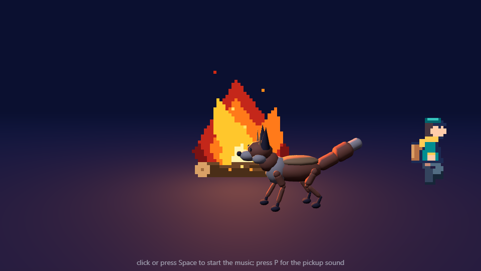
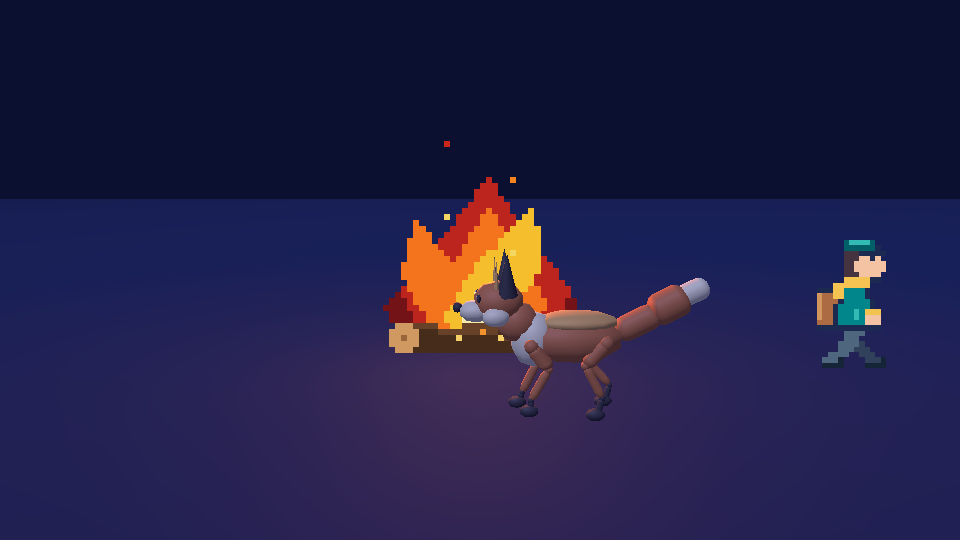
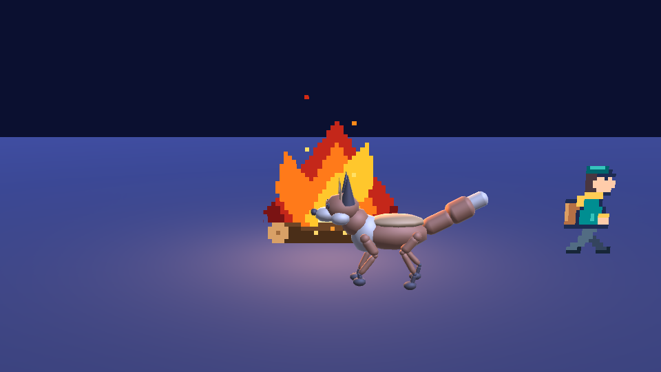

# Sample scene

One scene, built from assets made with the other plugins, that every engine has to pass. It is the
integration test for this plugin's skills: an agent following them should be able to rebuild the
scene in each engine and pass the same checks. It is a spec and a checklist, not a file format. The
first pass reuses existing assets, so it tests the glue and not the art.

## Assets

| Role | Asset | Checked |
|---|---|---|
| 3D character | `vulpine/model.glb` from the agent-meshes creature gallery (a fox) | GLB: 48 skins sharing 19 joints, clips `walk` and `trot`, no morphs. UE 5.7.3 import: one SkeletalMesh, one Skeleton, 2 animations, 48 material instances, no errors. |
| 2D character | `character-walk/dist/courier.atlas.json` from the agent-sprites examples | 12 frames, tag `walk` (frames 4 to 7, forward, 125 ms), a `pivot` slice. |
| 2D effect | [`examples/campfire`](../examples/campfire): an 8-frame looping campfire made with agent-sprites | 32x40 cells, tag `burn` (frames 8 to 15, 100 ms), pivot at bottom centre. The atlas lists 24 frames for 8 cells: raw cells, the tag's frames, then named cells. |
| Music bed | `survey-drone` from agent-beeps `library/songs/sci-fi-exploration` | Looping, 100 bpm, 172.8 s, 48 kHz stereo, -20 LUFS. The manifest says `loop: true` but the WAV has no loop metadata. |
| One-shot sound | `relic-discovered` (family pickup) from the agent-beeps sci-fi kit, 4 variants | 1.412 s each, manifest lists the variants with `noRepeat`. |

## Scene

A small clearing at dusk. The fox plays `walk` in profile, the campfire burns in the middle with a
warm light, and the courier billboard plays `walk` beside it. The music bed loops. The one-shot plays
on a trigger and picks among its variants. A fixed camera frames all three.

## Checks, strongest first

1. **Import.** Assets arrive with bone names, clip names, atlas tags, durations, pivot and variant
   count intact. Clip names may gain a prefix (see the skill).
2. **Clean run.** The scene loads and plays for a fixed time with no errors in the engine log.
3. **Screenshot.** A fixed-camera shot shows the fox, the campfire and the courier present and
   non-blank. Engines differ in lighting and shading, so compare roughly, not pixel for pixel. No
   automated pixel test exists yet; so far the screenshots are read by eye.
4. **Audio state.** The source exists, plays, loops where it should, and has the right variant
   count. Loudness is measured upstream by agent-beeps, so only "plays without error" is claimed in
   the engine.

## Status

| Engine | Verified | Not verified |
|---|---|---|
| Unreal 5.7.3 | Checks 1 and 2 for all assets; check 3 by eye (screenshot above); check 4 partly: the music bed reports playing, the campfire flipbook advances through its 8 frames at 10 fps, the fox animation plays, and the log has no errors. | Audio by ear; the pickup's variant picking (only variant 0 is placed, not playing); the courier flipbook's advance (samples landed on the same frame). |
| Godot 4.7.2 | Checks 1 and 2 for all assets, check 3 by eye (below), check 4 partly: Vulkan on the RTX 5090, the fox `walk` loops, the campfire (8 frames, 10 fps) and courier (4 frames, 8 fps) advance, the music bed reports playing with a loop end of 172.8 s, 12 pickups all start. | Audio by ear; which pickup variant played (not readable from a script). The log shows exit-time leak notices only, no run errors. |
| Unity 6000.3.25f1 | Checks 1 and 2 for all assets, check 3 by eye (below), check 4 almost fully, in a `-batchmode` Windows player on D3D12 on the RTX 5090: the fox `walk` plays and loops, the campfire (8 frames, 10 fps) and courier (4 frames, 8 fps) advance, the music bed plays and loops, 12 pickups are recorded with no immediate repeat, and the log hook saw zero errors and zero warnings. | Audio by ear; the bed looping end to end. No window can be presented in this session (see the Unity notes in the skill). |
| Unreal 5.8.3 | Checks 1 and 2 for all assets after three fixes (the fox split into 48 meshes, automated imports were not saved, FBX clips needed frame-aligned lengths); check 3 by eye ([screenshot](images/unreal-5.8-sample-scene.png)); check 4 partly: the music bed reports playing, both flipbooks advance, the fox animation plays and advances. Epic's MCP server also started headless and imported textures and an FBX. | Audio by ear, pickup variant picking, any automated pixel check. |
| UEFN 42.20 | Epic's MCP server on a set port; texture import; the fox as a skeletal mesh from a converted FBX. | A scene, a play-test session, the fox's clips after the frame-rate fix, audio import (no MCP route), the memory budget. |
| Web: three.js 0.186.1 | Checks 1 to 4 for all assets on the RTX 5090 in headless Chromium: the 3D fox GLB plays `walk` (clip names intact), the campfire (8 frames, 100 ms) and courier (4 frames, 125 ms) flipbooks advance, no console errors, the music bed starts after a click, 12 pickups use all 4 variants with no immediate repeat. Screenshot below, read by eye. | Audio by ear; the music actually looping across its 172 s. |
| Web: Phaser 3.90.0 | The same checks for the 2D parts (no fox in a 2D engine): the agent-sprites atlas loads unchanged through `load.aseprite`, both animations advance, no errors, variants as above. | Same as three.js. |

The scripts are in [`examples/unreal`](../examples/unreal), [`examples/godot`](../examples/godot), [`examples/unity`](../examples/unity) and [`examples/web`](../examples/web).

## Open

- A trigger and real variant picking for the one-shot.
- An automated screenshot check (pixel presence, not exact match).
- A UEFN build of the same scene.
- Choose and test the MCP server for each engine.
